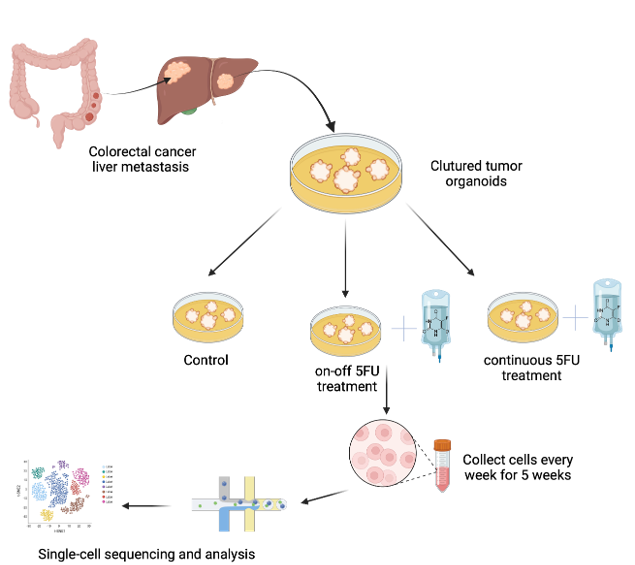
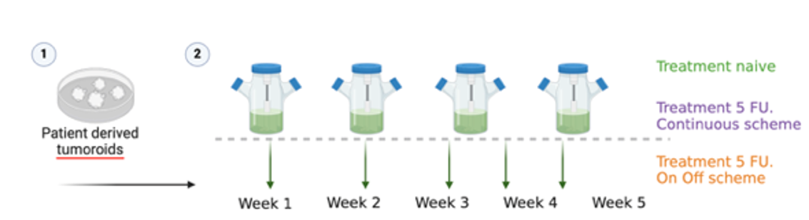

# Experimental Design

>We conducted a 3-arm, 7-week study to investigate single-cell plasticity in the CE05M CRLM PDO^[an organoid derived from a CRC Liver metastasis.]. Organoids were grown in Matrigel droplets for 1 week on culture plates and then carefully detached and placed into the PDO bioreactor. After two weeks of unrestrained growth, the population was divided into three bioreactors and treated either with:

- Dimethyl sulfoxide (DMSO)[^dmso] as the treatment-naïve arm (control)
- continuous exposure to 5-FU[^5fu] at its IC50 concentration (3 µM)
- 5-fluorouracil (5-FU)-based chemotherapy administered in an intermittent schedule (3 days with treatment, 4 days without), designed to mimic patient treatments.

[^dmso]: DMSO serves as the treatment-naïve control to isolate the effects of 5-FU-based treatments.
[^5fu]: 5-Fluorouracil, a chemotherapy drug that acts as a pyrimidine antagonist, replacing uracil and inhibiting thymidylate synthase to block DNA synthesis.



## Time lapse

PDOs were sampled weekly for 5 weeks, followed by single-cell RNA sequencing to analyze the transcriptional profiles of individual cells within the organoids in the population.



# Table of Contents

```{tableofcontents}
```
